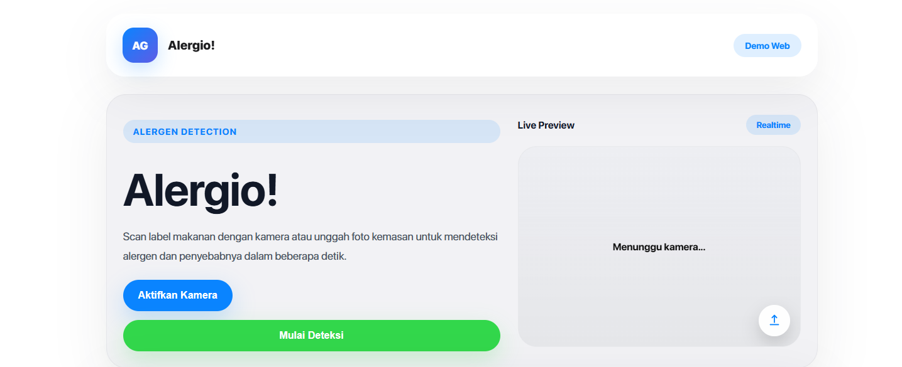

# 🧪 Alergio! — Offline Allergen Detection Web Prototype

[](https://opensource.org/licenses/MIT)
[](https://www.python.org/)
[](https://flask.palletsprojects.com/)
[](https://developer.mozilla.org/docs/Web/HTML)

**Alergio!** adalah prototipe web deteksi alergen yang dirancang untuk mendemonstrasikan user interface bergaya Apple, pemrosesan offline ringan, dan deteksi label makanan berbasis kamera / unggah foto.


*Antarmuka demo Alergio! dengan preview kamera, overlay unggah, dan visual gaya iPhone.*

## ✨ Fitur Utama

- 📷 **Live Camera Preview**: Menyediakan tampilan kamera langsung untuk mendeteksi label makanan.
- 📤 **Upload Image Overlay**: Unggah foto kemasan untuk pemrosesan deteksi secara manual.
- 🧠 **Prototype Deteksi Alergen**: Backend Flask stub siap menerima gambar untuk diproses lebih lanjut.
- 🎨 **Apple-Style UI**: Desain antarmuka sederhana, elegan, dan responsif.
- 🌐 **Mudah Dijalankan Secara Lokal**: Dikemas sebagai frontend statis dan backend Python dalam satu repo.

## 🛠️ Teknologi yang Digunakan (Tech Stack)

Proyek ini menggunakan arsitektur sederhana dan modular dengan pemisahan frontend dan backend.

### Frontend (Client-Side)
- **HTML**
- **CSS**
- **JavaScript**

### Backend (Server-Side)
- **Python 3.10+**
- **Flask**
- **flask-cors**

## 🚀 Cara Menjalankan Proyek

Ikuti langkah-langkah berikut untuk menjalankan aplikasi Alergio! secara lokal.

### 1. Clone Repositori
```bash
git clone https://github.com/adikusumaa/OCR-mobile-apps-allergic-detection.git
cd "Portofolio OCR Mobile Apps Allergic Detection"
```

### 2. Setup Backend
Buka terminal dan arahkan ke folder backend:
```bash
cd web/backend

# Buat virtual environment
python -m venv .venv

# Aktivasi venv (Windows)
.\.venv\Scripts\Activate.ps1

# Install dependencies
pip install -r requirements.txt
```

### 3. Jalankan Server Backend
```bash
python app.py
```

### 4. Buka Frontend di Browser
Buka file `web/frontend/index.html` di browser, atau gunakan server statis jika diinginkan.

## 📂 Struktur Direktori Utama
```text
Alergio!/
├── img/                      # Asset gambar untuk README dan dokumentasi
│   └── image.png
├── web/
│   ├── frontend/             # Frontend statis HTML/CSS/JS
│   │   ├── index.html
│   │   ├── styles/
│   │   └── utils/
│   └── backend/              # Backend Flask
│       ├── app.py
│       ├── requirements.txt
│       └── .env
├── .gitignore
├── ARCHITECTURE.md
├── PLANNING.md
├── PROJECT_STRUCTURE.md
├── TESTPLAN.md
└── README.md
```

## 🔧 Catatan Pengembangan

- Backend saat ini berupa stub API `/api/detect` yang mengembalikan respons dummy.
- Untuk mengaktifkan deteksi nyata, tambahkan komponen OCR / NLP dan logika validasi alergen.
- `web/frontend/index.html` sudah dioptimalkan untuk tampilan demo dengan kamera, upload, dan hasil deteksi.

## 🤝 Kontribusi

Jika kamu ingin membantu mengembangkan Alergio!:
1. Fork repositori ini.
2. Buat branch fitur baru: `git checkout -b feature/NamaFitur`.
3. Commit perubahan: `git commit -m "Menambahkan fitur baru"`.
4. Push ke remote: `git push origin feature/NamaFitur`.
5. Ajukan Pull Request.

---
*Dikembangkan oleh [adikusumaa]*
